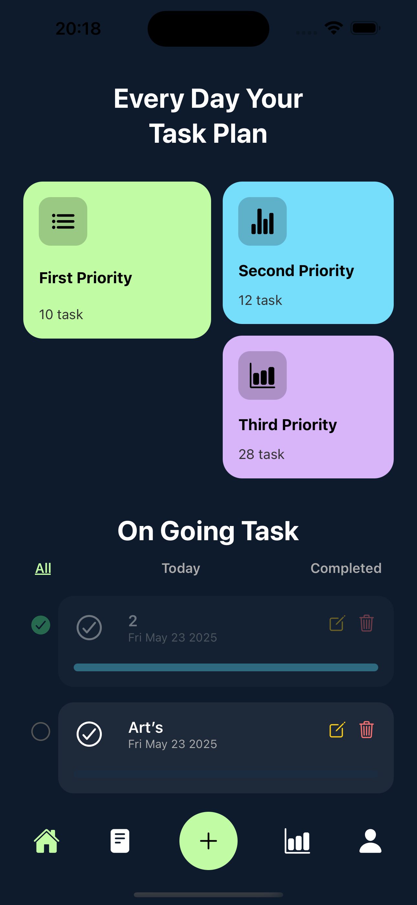
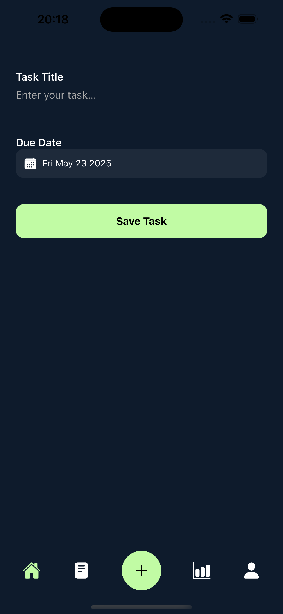

# 🧠 Task Manager App (todo-app-ins)

A sleek and minimalistic **task management app** built with **React Native** and **Expo**.  
Users can create, delete, and manage tasks with a clean dark-themed UI and persistent storage using AsyncStorage.

---

## ✨ Features

- 📝 Add, complete, and delete tasks
- 🌙 Dark mode interface
- 💾 Local data persistence with AsyncStorage
- 🔄 State management with React Hooks
- 📱 Responsive and mobile-friendly layout
- 🛠️ Expo-based quick deployment

---

## 🔧 Tech Stack

- **Framework:** React Native + Expo
- **Language:** TypeScript (TSX)
- **Storage:** AsyncStorage
- **Navigation:** React Navigation
- **Design:** Custom styled components + dark theme
- **Tooling:** GitHub, VS Code, Expo Go

---

## 📸 Screenshots

| Main View | Empty State |
|-----------|-------------|
|  |  |

---

## 🚀 Getting Started

To run the project locally:

```bash
git clone https://github.com/Cavga1903/todo-app-ins.git
cd todo-app-ins
npm install
npm start
```

After running npm start, Expo CLI will launch in your terminal and open the developer tools in your browser. You’ll see a QR code to run the app on your device.

After running npm start, Expo CLI will launch in your terminal and open the developer tools in your browser. You’ll see a QR code to run the app on your device.

📱 Run the app on your device
 • Install Expo Go from the App Store (iOS) or Google Play (Android).
 • Scan the QR code shown in your terminal or browser.
 • The app will open instantly on your phone.

💻 Run the app on a simulator/emulator
 • Press i to run on iOS Simulator (macOS & Xcode required).
 • Press a to run on Android Emulator (Android Studio required).
 • Press w to open in your web browser (limited support).

✅ Supports hot reload: Code changes reflect instantly on your device.

If you run into installation issues, try:

```bash
rm -rf node_modules
rm package-lock.json
npm install
```

🧠 What I Learned
 • How to build responsive UI components in React Native
 • Using AsyncStorage for persistent data
 • Managing state with React Hooks
 • Creating reusable button and input components
 • Styling and layout for mobile, dark theme

   📌 Future Improvements
 • 🔔 Push/local notification reminders
 • 🗂️ Task categories (Work, Study, Personal)
 • 🎨 Light/dark theme toggle
 • 🔍 Search & filter tasks
 • ✅ Swipe to complete/delete

   📫 Contact

Reach me at: <cavgaa228@gmail.com>
Or [](https://www.linkedin.com/in/tolgaacavgaa/)

⭐️ If you like this project…
 • ⭐ Star it on GitHub
 • 🍴 Fork it for your own use
 • 🧑‍💻 Follow me for more projects: @Cavga1903
